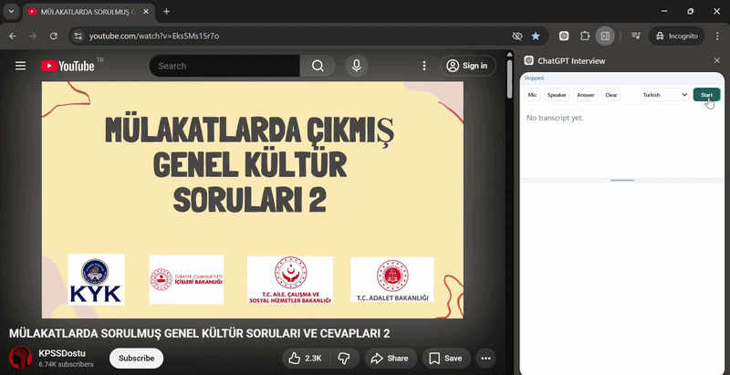

# ChatGPT Interview

ChatGPT Interview is a local Chrome extension that helps with live interview preparation and practice. It captures microphone and current-tab audio, transcribes speech with Deepgram, detects interview questions, and drafts concise answers through ChatGPT.

Desktop App -> https://github.com/barissandbox/Interview

---

## Features

- Live microphone and tab-audio transcription
- Question detection from interview transcripts
- Optional PDF CV context for more relevant answers

## Demo

## Install

1. Download the latest release: https://github.com/barissandbox/ChatGPTInterview/releases/latest/download/dist.zip
2. Unzip the archive.
3. Open `chrome://extensions`.
4. Enable **Developer mode**.
5. Click **Load unpacked**.
6. Select the extracted `dist` folder.

## Playground
https://www.youtube.com/watch?v=Eks5Ms15r7o

## Development

0. Clone the repository `git clone https://github.com/barissandbox/ChatGPTInterview`
1. Install dependencies with `npm install`.
2. Run the extension with `npm run dev`.
3. Open `chrome://extensions`.
4. Enable **Developer mode**.
5. Click **Load unpacked**.
6. Select the `dist` folder.

## License
MIT
